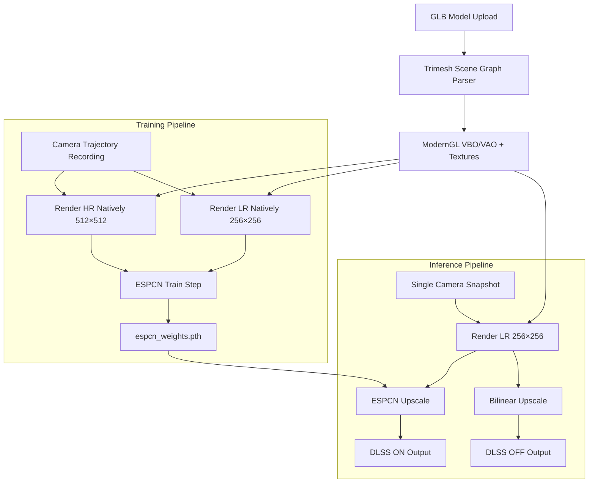
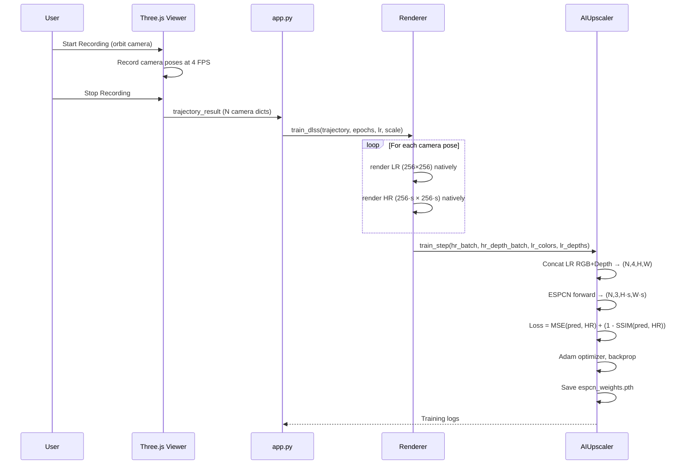
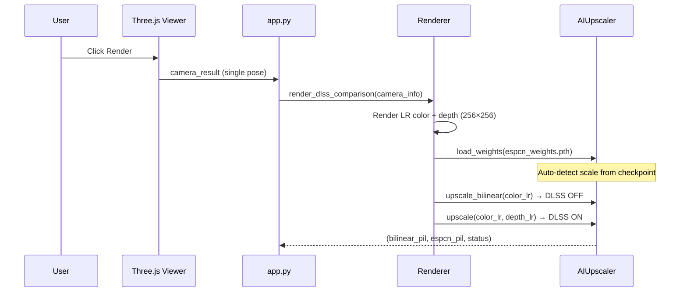

# DIY-DLSS: Real-Time AI Super Resolution for 3D Scenes

A custom implementation of DLSS (Deep Learning Super Sampling) that trains an ESPCN neural network on natively-rendered low/high-resolution frame pairs from a headless ModernGL renderer, then applies learned upscaling at inference time.

## Architecture Overview



## Project Structure

```
├── app.py                          # Gradio web app, JS↔Python bridge
├── metrics.py                      # PSNR / SSIM evaluation utilities
├── pipeline/
│   ├── camera/Camera.py            # View & projection matrix generation
│   ├── model/dlss_model.py         # ESPCN model, AIUpscaler wrapper
│   ├── renderer/Renderer.py        # Headless ModernGL render engine
│   ├── shader/shader.py            # GLSL vertex & fragment shaders
│   ├── scene/Scene.py              # Scene state container
│   └── utils/utils.py              # File I/O helpers
└── web_viewer/web/
    ├── three_viewer.html           # Three.js viewer (iframe)
    ├── three_script.js             # OrbitControls, camera relay, trajectory recording
    └── style.css / three_style.css
```

## Key Components

### 1. Renderer (`pipeline/renderer/Renderer.py`)

Headless OpenGL renderer using **ModernGL standalone context**. All GPU work runs on a dedicated worker thread via `queue.Queue` to avoid OpenGL context threading issues.

| Method | Description |
|---|---|
| `init_gl()` | Creates standalone ModernGL context, compiles shaders, allocates FBO |
| `_prepare_scene(path)` | Loads `.glb` via Trimesh, flattens scene graph with `dump()`, creates per-material VBO/VAO batches with texture binding |
| `_render_scene_to_fbo(cam)` | Renders all batches to FBO, reads back color (uint8→float32) and linearized depth |
| `_render_dlss_comparison(cam_info)` | Produces Bilinear vs ESPCN upscaled comparison from a single LR render |
| `_train_dlss(trajectory, ...)` | Renders **both LR and HR natively** per camera pose, feeds paired data to ESPCN training |

**Scene Graph Handling**: Uses `trimesh.Scene.dump()` instead of `geometry.values()` to correctly apply hierarchical node transforms from GLB files.

**Multi-Batch Rendering**: Each material/texture gets its own VBO + VAO. During rendering, textures are bound per-batch with `u_use_texture` uniform toggling.

### 2. Camera (`pipeline/camera/Camera.py`)

Synchronizes Python-side rendering with the Three.js frontend camera.

| Method | Description |
|---|---|
| `Camera.from_threejs(dict)` | Factory: parses `{position, rotation, target, fov, near, far, mode}` from frontend |
| `get_view_matrix()` | Computes 4×4 lookAt matrix. Uses `target` for third-person (OrbitControls), Euler angles for first-person |
| `get_projection_matrix()` | Standard perspective projection from FOV, aspect, near/far |

### 3. ESPCN Model (`pipeline/model/dlss_model.py`)

**Efficient Sub-Pixel Convolutional Neural Network** (Shi et al., 2016) adapted for depth-guided super resolution.

```
Input: (B, 4, H, W)  ← RGB + Depth
  ↓ Conv2d(4 → 64, k=5)  + ReLU
  ↓ Conv2d(64 → 32, k=3) + ReLU
  ↓ Conv2d(32 → 3·s², k=3)
  ↓ PixelShuffle(s)
Output: (B, 3, H·s, W·s)  ← Upscaled RGB
```

| Class / Method | Description |
|---|---|
| `ESPCN(scale_factor, in_channels=4)` | PyTorch model with sub-pixel convolution |
| `AIUpscaler.load_weights(path)` | Auto-detects scale factor from checkpoint tensor shapes; rebuilds model if scale mismatch |
| `AIUpscaler.train_step(hr, hr_d, ..., lr_colors, lr_depths)` | Trains on **natively-rendered** LR/HR pairs (eliminates bicubic domain gap). Loss = MSE + (1 − SSIM) |
| `AIUpscaler.upscale(color, depth)` | Inference: concatenates RGB+depth, runs ESPCN, returns float32 numpy |
| `AIUpscaler.upscale_bilinear(color)` | Baseline: PIL bilinear resize |

**Auto Scale Detection**: `load_weights()` inspects `net.4.weight.shape[0]` to infer `scale = sqrt(out_channels / 3)`. If the loaded scale differs from the current model, it rebuilds the ESPCN architecture before loading weights.

### 4. Shaders (`pipeline/shader/shader.py`)

| Shader | Details |
|---|---|
| **Vertex** | Transforms vertices by `u_model × u_view × u_proj`, passes world position, normal, UV |
| **Fragment** | Blinn-Phong with **directional sunlight** `(0.5, 1.0, 0.3)`. Ambient=0.5, Diffuse=0.6, Specular=0.1. Texture sampled via `u_use_texture` toggle |

### 5. Metrics (`metrics.py`)

| Function | Description |
|---|---|
| `psnr(img1, img2)` | Peak Signal-to-Noise Ratio (dB) |
| `ssim(img1, img2)` | Structural Similarity Index (uses scikit-image if available) |
| `compute_metrics(upscaled, gt)` | Returns `{"psnr": float, "ssim": float}` |
| `save_comparison(lr, espcn, bilinear, gt)` | Generates 2×2 comparison grid PIL image with metric overlays |

## Training Pipeline (Detail)



## Inference Pipeline (Detail)



## Setup

```bash
conda env create -f environment.yml
conda activate cg_hw3
python app.py
```

The app launches at `http://127.0.0.1:8000` with a Gradio share link.

## Key Design Decisions

1. **Native LR/HR Training Pairs**: Both LR and HR frames are rendered by the GPU at their respective resolutions, eliminating the domain gap that occurs when LR is created by mathematically downsampling HR (bicubic).

2. **Depth-Guided Upscaling**: The ESPCN takes 4-channel input (RGB + linearized depth), giving the network geometric context to better reconstruct edges and surfaces.

3. **Dedicated GL Thread**: All ModernGL calls execute on a single worker thread. The main Gradio thread communicates via `queue.Queue`, preventing OpenGL context conflicts.

4. **Auto Scale Detection**: Weights trained at any scale (2×, 3×, 4×) can be loaded without manual configuration. The `load_weights()` method inspects the PixelShuffle layer's output channel count to infer the correct scale factor.

5. **Scene Graph Flattening**: GLB models with hierarchical transforms are flattened via `trimesh.Scene.dump()`, which bakes world-space transforms into vertex positions, ensuring correct spatial layout in the headless renderer.
