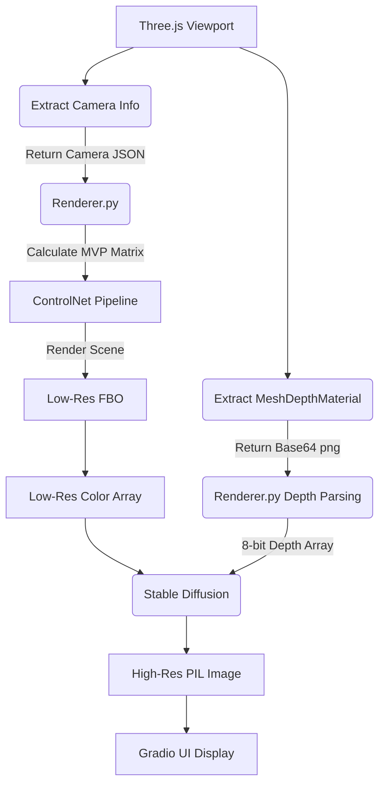

# CG HW3 

## Project Structure

```
CG_HW3/
├── app.py                          # Application entry point (Gradio Web Server)
├── pipeline/
│   ├── camera/Camera.py            # Camera utility (State parser for Three.js)
│   ├── scene/Scene.py              # Scene management (Models, lights, camera)
│   ├── renderer/Renderer.py        # Controller for ModernGL FBO & ControlNet logic
│   ├── shader/shader.py            # GLSL Vertex & Fragment shader configurations
│   ├── model/
│   │   ├── model.py                # Mesh Loader + Stable Diffusion/ControlNet engine
│   │   └── dlss_model.py           # PyTorch ESPCN (AI Upscaler) engine
│   └── utils/utils.py              # Utilities (File parsing, caching)
├── web_viewer/web/
│   ├── three_script.js             # Three.js mechanics (rendering, depth extraction)
│   ├── three_viewer.html           # HTML container for 3D viewer
│   ├── three_style.css             # CSS for three_viewer
│   └── style.css                   # Custom CSS styling for Gradio UI
├── input_model/                    # Temporary cache for user uploaded .obj files
├── .cache/                         # Local cache for downloaded Hugging Face models
└── environment.yml                 # Conda environment specifications
```

---

## 快速啟動 (Quick Start)

```bash
# 1. 建立環境
conda env create -f environment.yml
conda install nvidia::cuda-toolkit==11.8.0
conda activate cg_hw3

# 2. 啟動
python app.py
```

開啟 `http://127.0.0.1:7860` 即可使用。

---

## Rendering Pipeline


```mermaid
graph TD
    A[Three.js 取得網頁視角] --> B(擷取 MeshDepthMaterial)
    A --> C(擷取 Camera 資訊)
    
    B -->|回傳 Base64 png| D[app.py Gradio 介面]
    C -->|回傳 Camera JSON| D
    
    D --> E(Renderer_engine.render_pipeline)
    
    %% DLSS 軌道
    E --> F[計算 MVP 矩陣]
    F -->|載入 VBO/VAO| G[ModernGL Headless 渲染]
    G -->|256x256 FBO| H[Raw Color Array]
    G -->|256x256 FBO| I[Float32 Depth Array]
    H --> J(PyTorch ESPCN 超解析度模型)
    I --> J
    J --> K[DLSS Output: 512x512 高畫質圖]
    
    %% ControlNet 軌道
    E --> L[Base64 解碼與反相]
    L -->|Resize 512x512| M(ControlNet + SD1.5)
    M --> N[ControlNet Result: AI 風格化圖片]
### Implementation Phase Research: Rendering Architecture Choices

Before deciding on the Dual Rendering Pipeline, two methods for obtaining the Depth Map were explored:

#### Pathway 1: Backend-Only Rendering (ModernGL outputs Color + Depth) (**Adopted for DLSS Track**)
This is the standard DLSS approach. The frontend only provides Camera Information, and both Color and Depth are handled entirely by the backend OpenGL engine.
```mermaid
graph TD
    A[Three.js Viewport] --> B{Serialize Camera JSON}
    B -->|position, fov, target| C(Renderer.py)
    C -->|Calculate MVP Matrix| D[ModernGL Pipeline]
    D -->|Render Scene| E[Low-Res FBO]
    E --> F[Low-Res Color Array]
    E --> G[High-Precision Depth Array]
    F --> H(PyTorch ESPCN Model)
    G --> H
    H --> I[High-Res PIL Image]
    I --> J[Gradio UI Display]
```

#### Pathway 2: Hybrid Rendering (Three.js Depth + ControlNet) (**Adopted for ControlNet Track**)
Utilizes the depth map captured directly from the Three.js Canvas as the base for the Diffusion model.


### Scene (pipeline/scene/Scene.py)
- 管理 3D 場景中的模型、光源、相機
- `set_camera(camera)` 儲存當前相機視角
- `add_model(model)` 加入 3D 模型

### Renderer (pipeline/renderer/Renderer.py)
- 流程控制中樞
- `prepare_scene()` 載入模型至場景
- `render_diffuse_image()` 接收深度圖 + Prompt + 相機 → 呼叫 ControlNet 產生風格化圖

### Model (pipeline/model/model.py)
- `MeshModel` — OBJ 檔案載入 (頂點、面)
- `Model` — ControlNet + SD 1.5 推論引擎，lazy loading

### Utils (pipeline/utils/utils.py)
- `load_obj()` 解析 OBJ 格式
- `save_uploaded_model()` 儲存上傳檔案至 input_model/

---

## 3D Viewer 

- **OBJ + MTL + 貼圖支援**：上傳時自動偵測，貼圖轉 Base64 內嵌（繞過 Gradio 檔案伺服限制）   ## 修正：上傳檔案類型統一為 glb 
- **第一人稱 (WASD)**：Pointer Lock 控制，自由走動
- **第三人稱 (滑鼠)**：Orbit Controls，旋轉/平移/縮放
- **即時深度圖擷取**：MeshDepthMaterial 算繪，canvas 截圖


